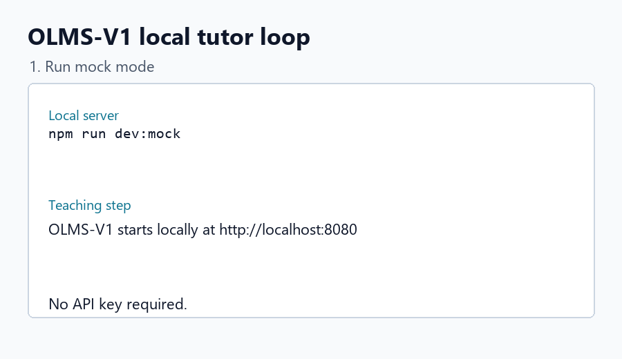

# OLMS-V1

[](https://github.com/Weller-Precision-Industries/OLMS-V1/actions/workflows/check.yml)

OLMS-V1 is a local SQLite AI tutor loop. Type a topic, get a focused teaching step, answer a short check, receive feedback, and continue through a saved local session.



## Tutor Loop

- Type a topic.
- Get a focused teaching step.
- Answer a check.
- Read feedback.
- Save progress locally in SQLite.
- Run in mock mode without an API key.

## Quickstart

Install dependencies:

```powershell
npm install
```

Run in mock mode:

```powershell
npm run dev:mock
```

Run with an API key:

```powershell
Copy-Item secrets\api-keys.template.txt secrets\api-keys.txt
notepad secrets\api-keys.txt
npm run dev
```

Open:

```text
http://localhost:8080
```

The app stores local session data in `data/olms-v1.sqlite` by default.

## Key Loading

`npm run dev` calls `scripts/dev/start-server.ps1`, which loads `secrets/api-keys.txt` before starting the server.

The shell equivalent is:

```bash
npm run dev:sh
```

Do not commit `secrets/api-keys.txt`.

## Mock Mode

Mock mode keeps the app runnable without paid API access:

```powershell
npm run dev:mock
```

You can also set:

```text
OLMS_MOCK_AI=true
```

## API

Start a session:

```http
POST /api/session/start
Content-Type: application/json

{ "topic": "probability" }
```

Submit an answer:

```http
POST /api/session/:id/answer
Content-Type: application/json

{ "answer": "Probability measures how likely an event is." }
```

Fetch a session:

```http
GET /api/session/:id
```

Health:

```http
GET /api/health
```

## Local SQLite Architecture

OLMS-V1 runs as a small local web server. `standalone-server.ts` owns HTTP routes, `src/tutor/store.ts` writes sessions and events to SQLite, `src/tutor/ai.ts` provides mock or OpenAI-backed tutor responses, and `src/templates/main.html` renders the browser experience.

See [docs/architecture.md](docs/architecture.md) and [docs/tutor-loop.md](docs/tutor-loop.md).

## License

OLMS-V1 is licensed under AGPL-3.0-only. If you modify it and let users interact with it over a network, the AGPL requires that those users can access the corresponding source code for your modified version.
